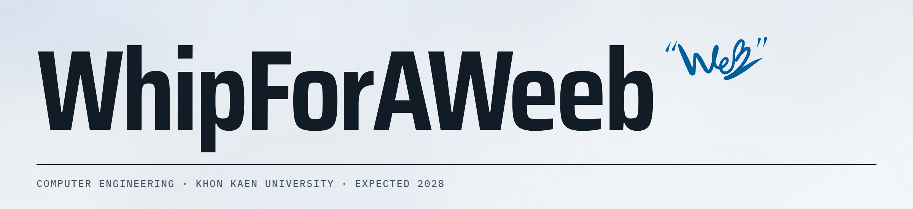

<picture>
  <source media="(prefers-color-scheme: dark)" srcset="assets/banner-dark.png">
  <source media="(prefers-color-scheme: light)" srcset="assets/banner-light.png">
  
</picture>

I build and test the support around AI coding tools: memory, skills and checks for when they get things wrong or forget.

`LOOKING FOR` An AI engineering internship, from 10 April 2027 until the KKU semester starts (dates estimated), on-site or remote.

---

<picture>
  <source media="(prefers-color-scheme: dark) and (max-width: 640px)" srcset="https://profile-widgets-sigma.vercel.app/api/activity?theme=dark&size=narrow">
  <source media="(max-width: 640px)" srcset="https://profile-widgets-sigma.vercel.app/api/activity?theme=light&size=narrow">
  <source media="(prefers-color-scheme: dark)" srcset="https://profile-widgets-sigma.vercel.app/api/activity?theme=dark">
  
</picture>

<picture>
  <source media="(prefers-color-scheme: dark) and (max-width: 640px)" srcset="https://profile-widgets-sigma.vercel.app/api/repos?theme=dark&size=narrow">
  <source media="(max-width: 640px)" srcset="https://profile-widgets-sigma.vercel.app/api/repos?theme=light&size=narrow">
  <source media="(prefers-color-scheme: dark)" srcset="https://profile-widgets-sigma.vercel.app/api/repos?theme=dark">
  
</picture>

<picture>
  <source media="(prefers-color-scheme: dark) and (max-width: 640px)" srcset="https://profile-widgets-sigma.vercel.app/api/languages?theme=dark&size=narrow">
  <source media="(max-width: 640px)" srcset="https://profile-widgets-sigma.vercel.app/api/languages?theme=light&size=narrow">
  <source media="(prefers-color-scheme: dark)" srcset="https://profile-widgets-sigma.vercel.app/api/languages?theme=dark">
  
</picture>

---

`NOW`

- **Memory Base**: a memory that carries over between coding-assistant sessions. In the experiment phase.
- **[WhipUI](https://github.com/VVeb1250/WhipUI)**: two skills for coding agents, one builds from a spec, one turns a rough request into UX and visual work. `npx whipui init`

`UPSTREAM` Merged: [AgentsMesh #102](https://github.com/sampleXbro/agentsmesh/pull/102), [ai-config-sync-manager #28](https://github.com/slash9494/ai-config-sync-manager/pull/28)

---

[**Portfolio**](https://vveb1250.github.io) · [CV](https://vveb1250.github.io/cv/Teethawat-Kumying-CV.pdf) · [supimol.web@gmail.com](mailto:supimol.web@gmail.com) · [Pixiv](https://www.pixiv.net/en/users/116719673)
